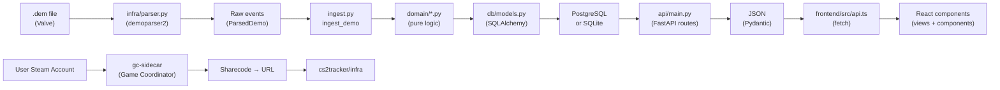

# cStats cs2-tracker — Project Index

## Overview

Auto-generated index of the active cS2-tracker monorepo. Consult this before exploring with Glob/Grep/Read to save tokens.

```
cs2-tracker/
├── backend/           # Python 3.11 + FastAPI + SQLAlchemy (see backend/PROJECT_INDEX.md)
├── frontend/          # React 18 + TypeScript + Vite (see frontend/PROJECT_INDEX.md)
├── gc-sidecar/        # Node.js microservice, Game Coordinator client
├── docker-compose.yml # Local Postgres for dev
└── PROJECT_INDEX.md   # This file (overview only)
```

---

## Data Flow



---

## Backend Module Layering

**Strict one-way dependency rule:**
- `domain/` → depends on nothing project-internal (pure business logic)
- `infra/` → depends on `domain`
- `api/` → depends on `domain` + `infra`
- `db/` → used by all layers (models + session)

For detailed per-file breakdown, see **`backend/PROJECT_INDEX.md`** (57 files, ~9100 lines).

---

## Frontend Routing & State

- **App.tsx** — auth gate + routing
- **context/UserContext.tsx** — logged-in user identity (no Redux)
- **views/** — page components (one per route: HomeView, ProfileView, MatchDetailView, etc.)
- **components/** — presentational components
- **api.ts** — HTTP client (~33 functions, all /api/* routes)
- **types.ts** — TypeScript schemas mirroring Pydantic (no internal imports — hub file)

For detailed per-file breakdown, see **`frontend/PROJECT_INDEX.md`** (70 files, ~7550 lines).

---

## gc-sidecar (Node.js Microservice)

Tiny, separate process — talks to Steam's Game Coordinator to resolve sharecode → demo URL.

| File | Lines | Purpose |
|---|---|---|
| `src/index.js` | ~50 | Express server (127.0.0.1, no auth, internal only) |
| `src/gc.js` | ~100 | Steam GC client (steam-user + globaloffensive packages) |

Only called by `backend/cs2tracker/infra/gc_client.py` (auto-fetch feature).

---

## Regenerating the Indices

The other two indices (`backend/PROJECT_INDEX.md` and `frontend/PROJECT_INDEX.md`) are **auto-generated** from AST/TypeScript Compiler analysis. This file is **hand-written** — only update if folder structure changes.

```bash
# After touching imports/exports or adding/removing files:
cd cs2-tracker/backend && python tools/build_index.py
cd cs2-tracker/frontend && npm run build:index

# Commit all three PROJECT_INDEX.md files
git add backend/PROJECT_INDEX.md frontend/PROJECT_INDEX.md PROJECT_INDEX.md
git commit -m "Regenerate project indices"
```

---

## Key Files to Know

| Path | Purpose |
|---|---|
| `backend/cs2tracker/config.py` | Environment config (pydantic-settings, CS2_* prefix) |
| `backend/cs2tracker/auth.py` | Steam OpenID 2.0 login |
| `backend/cs2tracker/ingest.py` | Main ingestion orchestrator |
| `backend/cs2tracker/api/main.py` | FastAPI app + most routes (888 lines) |
| `backend/cs2tracker/api/queries.py` | SQLAlchemy cross-match queries (1129 lines) |
| `backend/cs2tracker/domain/badges/` | Subpackage: badge triggers |
| `frontend/src/api.ts` | HTTP client (hub file, ~20+ importers) |
| `frontend/src/types.ts` | TypeScript types (hub file, ~30 importers, 65+ exports) |
| `CLAUDE.md` | Project instructions (from cStats root) |

---

## Commands

### Backend
```bash
cd backend
python -m venv .venv && .venv\Scripts\activate
pip install -e ".[dev]"
pytest                        # run all tests
cs2-api                       # start FastAPI server (http://127.0.0.1:8000)
python tools/build_index.py   # regenerate backend/PROJECT_INDEX.md
```

### Frontend
```bash
cd frontend
npm install
npm run dev                   # http://localhost:5173, proxies /api -> :8000
npm run lint
npm run build:index           # regenerate frontend/PROJECT_INDEX.md
```

### Local Postgres (optional)
```bash
docker compose up -d          # starts Postgres
alembic upgrade head          # run migrations
```

---

**Last updated**: 2026-08-05  
**Index regenerated by**: `build_index.py` (backend) + `build_index.js` (frontend)
