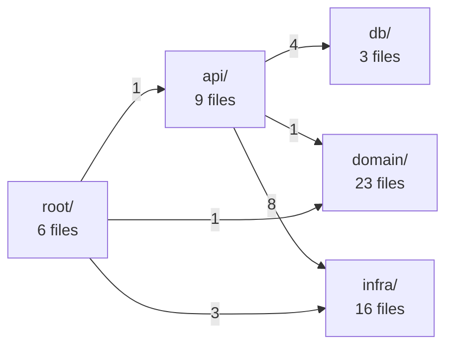

<!-- AUTO-GENERATED by `python tools/build_index.py`. DO NOT EDIT. -->

# Backend Index — cs2tracker

57 files · 9100 lines

## Module Graph

## Summary by Module

| Module | Files | Lines | Description |
|---|---|---|---|
| `api/` | 9 | 3338 | FastAPI routes and schemas |
| `db/` | 3 | 514 | SQLAlchemy models and session |
| `domain/` | 23 | 2360 | Pure business logic (no project dependencies) |
| `infra/` | 16 | 1775 | External integrations (parser, sources, etc.) |
| `root/` | 6 | 1113 |  |

## api/

| File | Lines | Exports | Imports |
|---|---|---|---|
| `api\__init__.py` | 1 | — | — |
| `api\account.py` | 401 | _DUMMY_HASH, auth_register, auth_verify_email, auth_resend_verification, auth_steam_link, auth_callback, auth_login, auth_forgot_password, auth_reset_password, auth_me, auth_logout | cs2tracker.api.schemas, cs2tracker.auth, cs2tracker.auth_password |
| `api\autofetch.py` | 111 | AUTH_CODE_RE, autofetch_status, autofetch_link, autofetch_unlink | cs2tracker.api.schemas, cs2tracker.auth, cs2tracker.config |
| `api\internal.py` | 51 | require_internal_secret, steam_user_registered, steam_user_bot_friend_confirmed | cs2tracker.config, cs2tracker.db, cs2tracker.db.session |
| `api\main.py` | 888 | lifespan, list_matches, cs2_news, match_detail, match_kills, match_duels, match_weapons, match_badges, match_clutches, player_rivals, player_compare, player_profile, player_weapons_detail, match_economy, player_profile_tags… | cs2tracker, cs2tracker.api, cs2tracker.api.account |
| `api\onboarding.py` | 85 | onboarding_status, onboarding_demographics, onboarding_complete | cs2tracker.api.schemas, cs2tracker.auth, cs2tracker.config |
| `api\queries.py` | 1129 | MIN_SAMPLE, shares_a_match, is_participant, match_history, lifetime_weapon_kills, lifetime_rounds_played, weapon_breakdown_inputs, loadout_breakdown_inputs, lifetime_hitgroup_counts, lifetime_trade_kills, role_inputs, clutch_timeline, biggest_clutch_won, rivals, compare_players… | cs2tracker.db, cs2tracker.domain, cs2tracker.domain.badges |
| `api\scene.py` | 125 | _RANKING_KEY, _STREAMS_KEY, team_ranking, latam_streams | cs2tracker.api.schemas, cs2tracker.auth, cs2tracker.config |
| `api\schemas.py` | 547 | RegisterIn, LoginIn, ForgotPasswordIn, ResetPasswordIn, MeOut, AutofetchLinkIn, AutofetchStatusOut, DemographicsIn, OnboardingStatusOut, MatchSummary, PlayerRow, TeamScore, MatchDetail, KillPoint, KillsResponse… | — |

## db/

| File | Lines | Exports | Imports |
|---|---|---|---|
| `db\__init__.py` | 49 | — | cs2tracker.db.models, cs2tracker.db.session |
| `db\models.py` | 418 | Base, Match, Player, AccountSignup, User, MatchPlayer, Round, Kill, Damage, Grenade, Blind, PlayerMapEvent, PlayerMapZone, PlayerClutch, PlayerMatchStats… | — |
| `db\session.py` | 47 | get_engine, init_db, get_session | cs2tracker.config, cs2tracker.db.models |

## domain/

| File | Lines | Exports | Imports |
|---|---|---|---|
| `domain\__init__.py` | 70 | — | cs2tracker.domain.coach, cs2tracker.domain.duels, cs2tracker.domain.kast |
| `domain\badges\__init__.py` | 32 | compute_badges | — |
| `domain\badges\catalog.py` | 144 | ENTRY_KING_MIN_FB, ENTRY_KING_MIN_WINRATE, CLUTCH_MINISTER_MIN, UTILITY_GOD_MIN_BLIND_S, UTILITY_GOD_MIN_DMG, TEAM_FLASHER_MIN, LURKEA_MUCHO_MIN_RATE, FORCE_BUY_GANADOR_MIN, ECO_FRAG_MIN, AHORRA_BIEN_MIN_RATE, CATALOG | — |
| `domain\badges\evaluador.py` | 35 | MIN_JUGADORES_RELATIVO, evaluar_badges | — |
| `domain\badges\render.py` | 36 | TIER_ICON, TIER_KIND, to_legacy | — |
| `domain\badges\types.py` | 85 | Categoria, Tier, UmbralTipo, MatchBadgeInputs, BadgeDef, Badge | — |
| `domain\coach.py` | 99 | DEFAULT_EARLY_THRESHOLD_S, MIN_CONFIDENT_MATCHES, DEFAULT_TICKRATE, seconds_into_round, early_round_death_pattern, describe_early_round_deaths | — |
| `domain\duels.py` | 80 | _EVENT_FIELDS, DuelData, compute_duels | — |
| `domain\economia.py` | 158 | FULL_BUY_MIN, FORCE_BUY_MIN, SEMI_ECO_MIN, MILLONARIO_MIN_PRICE, WEAPON_PRICE, clasificar_tipo_compra, tasa_buena_economia, detectar_eco_frag, filtrar_compras_reales, detectar_millonario, es_arma_real | cs2tracker.domain.profile |
| `domain\highlights.py` | 50 | MIN_KILLS_HIGHLIGHT, SCORE_PER_KILL, SCORE_PER_CLUTCH_ENEMY, score_moments | — |
| `domain\kast.py` | 190 | DEFAULT_TRADE_TICKS, find_traded_deaths, find_trade_kills, kast_rounds_for_player, compute_kast | — |
| `domain\loadouts.py` | 105 | LOADOUT_FULL_MIN, LOADOUT_SEMI_MIN, REGULATION_HALF_LEN, OT_HALF_LEN, OT_START, TIERS, ACS_KILL_BONUS, ACS_ASSIST_BONUS, is_pistol_round, loadout_tier, aggregate_loadout_stats | — |
| `domain\lurker.py` | 71 | DEFAULT_UMBRAL_DISTANCIA, DEFAULT_UMBRAL_TARDIO_SEG, aislamiento_ronda, es_ronda_lurker, tasa_lurker | — |
| `domain\monthly.py` | 210 | MonthBounds, month_bounds, MonthlyTotals, MonthlyHeadline, MatchesPerDay, TopMap, MonthlyMvp, MonthlyDetail, MonthlySummary, compute_monthly_summary | — |
| `domain\percentiles.py` | 82 | MIN_JUGADORES_GLOBAL, PERCENTILES, calcular_percentiles, TAGS_GLOBALES, TAG_LABELS, evaluar_tags_globales | — |
| `domain\profile.py` | 370 | WEAPON_CATEGORY, MELEE_WEAPONS, _NON_WEAPON_CAUSES, _ENV_CAUSES, HAMMER_UNIT_TO_METERS, _HITGROUP_ZONE, accuracy_stats, top_weapons, weapon_breakdown, lifetime_stats, map_pool, best_map, rank_history, milestones | — |
| `domain\rating.py` | 23 | compute_rating | — |
| `domain\roles.py` | 42 | AWP_SHARE_THRESHOLD, ENTRY_ATTEMPTS_PER_MATCH, EFFECTIVE_FLASHES_PER_MATCH, dominant_role | — |
| `domain\rounds.py` | 153 | find_entry_events, compute_round_stats, find_clutch_situations | — |
| `domain\social.py` | 29 | calcular_winrate_conjunto | — |
| `domain\stats.py` | 77 | PlayerStat, compute_stats | — |
| `domain\teams.py` | 67 | TeamResolution, resolve_teams | — |
| `domain\utility.py` | 152 | DEFAULT_DAMAGE_WINDOW_TICKS, DEFAULT_TICKRATE, _HE_MOLOTOV_WEAPONS, FlashEffect, compute_flash_effectiveness, compute_utility_damage, find_flash_assists | — |

## infra/

| File | Lines | Exports | Imports |
|---|---|---|---|
| `infra\__init__.py` | 1 | — | — |
| `infra\clips.py` | 211 | TICK_STRIDE, FPS, RADAR_SIZE, RADAR_X, RADAR_Y, PAD_SECONDS, BG, COLOR_T, COLOR_CT, COLOR_HERO, COLOR_TEXT, COLOR_DIM, render_clip | cs2tracker |
| `infra\demo_download.py` | 46 | download_and_extract | — |
| `infra\gc_client.py` | 143 | SidecarUnavailable, DemoExpired, get_bot_steamid, notify_match_ready, sidecar_healthy, resolve_demo, fetch_premier_profile | — |
| `infra\hltv_ranking.py` | 94 | RANKING_URL, RankedTeam, parse_hltv_ranking, fetch_hltv_top10 | — |
| `infra\kick.py` | 135 | _TOKEN_URL, _CATEGORIES_URL, _LIVESTREAMS_URL, is_configured, pick_cs_category, fetch_latam_cs_streams | cs2tracker.config, cs2tracker.infra.streams_common |
| `infra\mail.py` | 31 | send_email | cs2tracker.config |
| `infra\parser.py` | 422 | match_id_from_name, ParsedDemo, _SIDE, _GRENADE_EVENTS, parse_demo, _EQUIP_VALUE_PROP, _CASH_SPENT_PROP, _START_ACCOUNT_PROP, _RANK_TYPE_PROP | cs2tracker.domain |
| `infra\sharecode.py` | 96 | _ALPHABET, SHARECODE_RE, DecodedSharecode, extract_sharecode, decode_sharecode, encode_sharecode, match_id_str, demo_filename | — |
| `infra\sources.py` | 227 | Source, FolderSource, SteamAutoSource | cs2tracker.config, cs2tracker.db, cs2tracker.infra.demo_download |
| `infra\steam_news.py` | 62 | CS2_APPID, _BBCODE_RE, _WHITESPACE_RE, SteamNewsItem, fetch_cs2_news | — |
| `infra\steam_sharecodes.py` | 68 | NEXT_CODE_URL, SharecodeChainError, AuthCodeInvalid, RateLimited, get_next_sharecode | — |
| `infra\streams_common.py` | 16 | LiveStream | — |
| `infra\ttl_cache.py` | 37 | TtlCache | — |
| `infra\twitch.py` | 103 | CS_GAME_ID, _TOKEN_URL, _STREAMS_URL, is_configured, fetch_latam_cs_streams | cs2tracker.config, cs2tracker.infra.streams_common |
| `infra\valve_ranking.py` | 83 | _CONTENTS_URL, _ROW_RE, parse_valve_standings, fetch_valve_top10 | cs2tracker.infra.hltv_ranking |

## root/

| File | Lines | Exports | Imports |
|---|---|---|---|
| `__init__.py` | 3 | — | — |
| `auth.py` | 291 | STEAM_OPENID_URL, _CLAIMED_ID_RE, COOKIE_NAME, SESSION_MAX_AGE, STEAM_PROFILE_REFRESH_INTERVAL, steam_profile_is_stale, _BROWSER_HEADERS, _VIDEO_URL_RE, _BACKGROUND_URL_RE, parse_profile_background_url, build_login_url, verify_callback, fetch_profile, fetch_profiles, create_session_cookie… | cs2tracker.config |
| `auth_password.py` | 120 | PENDING_COOKIE_NAME, PENDING_SESSION_MAX_AGE, EMAIL_VERIFY_MAX_AGE, PASSWORD_RESET_MAX_AGE, _EMAIL_RE, normalize_email, is_valid_email, hash_password, verify_password, create_pending_cookie, read_pending_cookie, get_current_pending_id, get_current_pending_id_optional, create_email_verify_token, read_email_verify_token… | cs2tracker.config |
| `config.py` | 98 | Settings | — |
| `ingest.py` | 553 | _UTILITY_EVENT_TYPES, _DAMAGE_WEAPONS, ingest_demo, main | cs2tracker, cs2tracker.api.queries, cs2tracker.config |
| `maps.py` | 48 | RADAR_SIZE, MAP_TRANSFORMS, to_radar_norm, has_radar, GRID_CELLS_PER_AXIS, to_grid_cell | — |