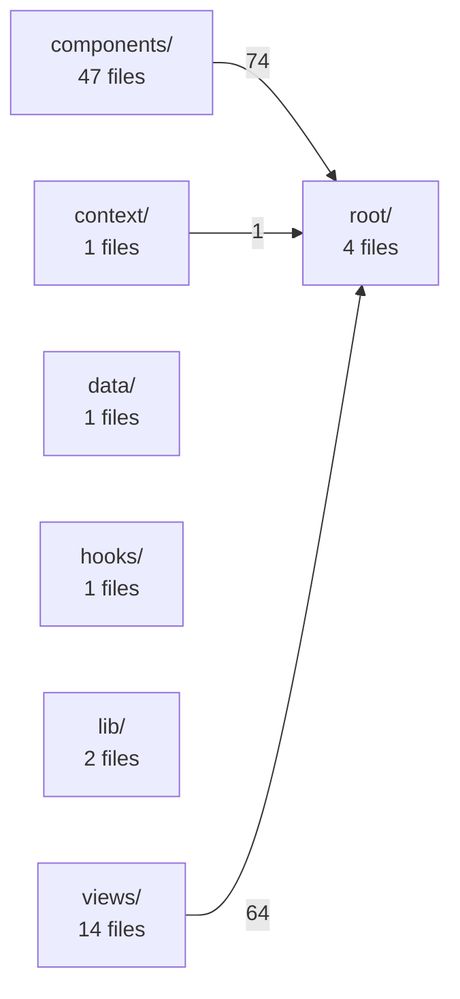

<!-- AUTO-GENERATED by `node tools/build_index.js`. DO NOT EDIT. -->

# Frontend Index — src/

70 files · 7550 lines

## Module Graph

## Summary by Module

| Module | Files | Lines | Description |
|---|---|---|---|
| `components/` | 47 | 3725 | Presentational components |
| `context/` | 1 | 13 | React Context state |
| `data/` | 1 | 33 | Data constants |
| `hooks/` | 1 | 80 | Custom React hooks |
| `lib/` | 2 | 111 | Utility functions |
| `root/` | 4 | 996 |  |
| `views/` | 14 | 2592 | Page-level components |

## components/

| File | Lines | Exports | Imports |
|---|---|---|---|
| `components\AccuracyPanel.tsx` | 142 | AccuracyPanel | types.ts, components/AccuracySilhouette.tsx |
| `components\AccuracySilhouette.tsx` | 90 | ZoneGlow, ZoneVisual, AccuracySilhouette | — |
| `components\AnimatedNumber.tsx` | 57 | AnimatedNumber | components/motion/presets.ts |
| `components\AutoFetchSettings.tsx` | 78 | AutoFetchSettings | api.ts, types.ts |
| `components\AutofetchLinkForm.tsx` | 96 | AutofetchLinkForm | api.ts, types.ts |
| `components\BadgeStrip.tsx` | 39 | BadgeStrip | api.ts, types.ts |
| `components\Button.tsx` | 14 | Button | — |
| `components\Card.tsx` | 6 | Card | — |
| `components\ClipsPanel.tsx` | 118 | ClipsPanel | api.ts, types.ts |
| `components\ClutchTimeline.tsx` | 47 | ClutchTimeline | api.ts, types.ts |
| `components\CoachCorner.tsx` | 36 | CoachCorner | types.ts |
| `components\CrosshairIcon.tsx` | 60 | CrosshairIcon | — |
| `components\DuelClashRow.tsx` | 147 | DuelClashRow | types.ts |
| `components\DuelMatrix.tsx` | 286 | DuelMatrix | api.ts, components/motion/presets.ts |
| `components\EconomyTimeline.tsx` | 52 | EconomyTimeline | api.ts, types.ts |
| `components\Heatmap.tsx` | 102 | Heatmap | api.ts, types.ts |
| `components\HeroStreamCarousel.tsx` | 128 | HeroStreamCarousel | types.ts |
| `components\Logo.tsx` | 8 | Logo | — |
| `components\MapStatsPopover.tsx` | 31 | MapStatsPopover | — |
| `components\MapWallpaperCarousel.tsx` | 63 | MapWallpaperCarousel | — |
| `components\PremierRankUpEffect.tsx` | 74 | PremierRankUpEffect | — |
| `components\ProfileTagChips.tsx` | 39 | ProfileTagChips | api.ts, types.ts |
| `components\RankBadge.tsx` | 48 | tierClass, RankBadge | — |
| `components\RankHistoryCard.tsx` | 262 | RankHistoryCard | types.ts |
| `components\Scoreboard.tsx` | 49 | ratingColor, Scoreboard | components/RankBadge.tsx, types.ts |
| `components\SectionLabel.tsx` | 6 | SectionLabel | — |
| `components\SquadCard.tsx` | 67 | SquadCard | api.ts, types.ts |
| `components\TopMapsPanel.tsx` | 58 | TopMapsPanel | types.ts |
| `components\TopWeaponsPanel.tsx` | 41 | TopWeaponsPanel | data/weaponNames.ts, types.ts |
| `components\Topbar.tsx` | 110 | Topbar | context/UserContext.tsx, components/Logo.tsx |
| `components\WeaponCategoryIcon.tsx` | 30 | WeaponCategoryIcon | types.ts |
| `components\WeaponSilhouette.tsx` | 32 | WeaponSilhouette | types.ts, components/WeaponCategoryIcon.tsx |
| `components\Weapons.tsx` | 72 | Weapons | api.ts, types.ts |
| `components\match-history\MatchCard.tsx` | 95 | MatchCard | components/motion/presets.ts, types.ts |
| `components\match-history\MatchFilterBar.tsx` | 78 | MatchTypeTab, SecondaryFilter, MatchFilterBar | — |
| `components\match-history\MatchHistory.tsx` | 73 | MatchHistory | components/motion/presets.ts, types.ts |
| `components\monthly\MatchesPerDayChart.tsx` | 33 | MatchesPerDayChart | types.ts |
| `components\monthly\MonthlySummaryHero.tsx` | 142 | MonthlySummaryHero | api.ts, context/UserContext.tsx |
| `components\monthly\StatCard.tsx` | 19 | StatCard | — |
| `components\motion\LogoIntroTransition.tsx` | 42 | LOGO_TRANSITION_DURATION_MS, LogoIntroTransition | components/motion/TacticalBadge3D.tsx |
| `components\motion\SmoothScroll.tsx` | 25 | SmoothScroll | — |
| `components\motion\TacticalBadge3D.tsx` | 398 | AccentName, TacticalBadge3DProps, TacticalBadge3D | — |
| `components\motion\presets.ts` | 27 | ROUTE_FADE, CARD_DURATION, CARD_STAGGER, COUNT_DURATION, staggerList, cardRise, LIVE_PULSE_DURATION, livePulse | — |
| `components\weapons\LoadoutCard.tsx` | 107 | LOADOUT_ORDER, LoadoutCard | components/motion/presets.ts, types.ts |
| `components\weapons\LoadoutList.tsx` | 15 | LoadoutList | components/motion/presets.ts, components/weapons/LoadoutCard.tsx |
| `components\weapons\WeaponHeroGrid.tsx` | 58 | WeaponHeroGrid | components/motion/presets.ts, data/weaponNames.ts |
| `components\weapons\WeaponTable.tsx` | 125 | WeaponTable | data/weaponNames.ts, components/WeaponSilhouette.tsx |

## context/

| File | Lines | Exports | Imports |
|---|---|---|---|
| `context\UserContext.tsx` | 13 | UserContext, useUser | types.ts |

## data/

| File | Lines | Exports | Imports |
|---|---|---|---|
| `data\weaponNames.ts` | 33 | NICE_WEAPON_NAME, niceWeaponName, WEAPON_CATEGORY_LABEL | — |

## hooks/

| File | Lines | Exports | Imports |
|---|---|---|---|
| `hooks\useSteamBackground.ts` | 80 | useSteamBackground | — |

## lib/

| File | Lines | Exports | Imports |
|---|---|---|---|
| `lib\csgoRankEquivalent.tsx` | 103 | CsgoRank, CSGO_RANKS, csgoRankFor, RankCrest | — |
| `lib\premierRating.ts` | 8 | isPromotionalMatch | — |

## root/

| File | Lines | Exports | Imports |
|---|---|---|---|
| `App.tsx` | 170 | App | api.ts, components/Topbar.tsx |
| `api.ts` | 281 | getMe, steamLinkUrl, logout, register, login, resendVerification, forgotPassword, resetPassword, listMatches, getMatch, getKills, getWeapons, getMatchDuels, getMatchBadges, getMatchClutches | types.ts |
| `main.tsx` | 28 | — | App.tsx |
| `types.ts` | 517 | User, MeOut, MatchSummary, PlayerRow, TeamScore, MatchDetail, KillPoint, KillsResponse, WeaponStat, PlayerWeapons, WeaponsResponse, LifetimeStats, MapPoolEntry, MatchHistoryEntry, Badge | — |

## views/

| File | Lines | Exports | Imports |
|---|---|---|---|
| `views\EmailVerificationPendingView.tsx` | 64 | EmailVerificationPendingView | api.ts, components/Button.tsx |
| `views\ForgotPasswordView.tsx` | 60 | ForgotPasswordView | api.ts, components/Button.tsx |
| `views\HomeView.tsx` | 237 | HomeView | api.ts, components/HeroStreamCarousel.tsx |
| `views\LandingView.tsx` | 140 | LandingView | components/Card.tsx, components/Logo.tsx |
| `views\LineUps.tsx` | 796 | LineUps | components/SectionLabel.tsx, components/Topbar.tsx |
| `views\LoginView.tsx` | 133 | LoginView | api.ts, components/Logo.tsx |
| `views\MatchDetailView.tsx` | 188 | MatchDetailView | api.ts, context/UserContext.tsx |
| `views\OnboardingView.tsx` | 295 | OnboardingView | api.ts, components/AutofetchLinkForm.tsx |
| `views\PrefireView.tsx` | 70 | PrefireView | — |
| `views\ProfileView.tsx` | 250 | ProfileView | api.ts, components/AccuracyPanel.tsx |
| `views\RegisterView.tsx` | 152 | RegisterView | api.ts, components/Logo.tsx |
| `views\ResetPasswordView.tsx` | 86 | ResetPasswordView | api.ts, components/Button.tsx |
| `views\SettingsView.tsx` | 64 | SettingsView | api.ts, components/AutoFetchSettings.tsx |
| `views\WeaponsView.tsx` | 57 | WeaponsView | api.ts, components/weapons/LoadoutList.tsx |